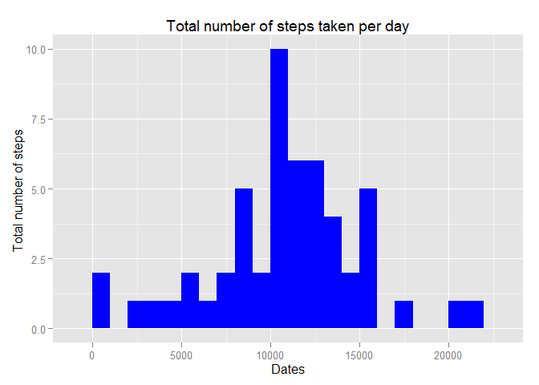

# Reproducible Research: Peer Assessment 1


##Loading and preprocessing the data 
1. Load the data  

- Add ggplot2 library and set project working directory  

```r
library(ggplot2)

message("... Setting Working Directory ...")
```

```
## ... Setting Working Directory ...
```

```r
directory <- c("E:\\Temp\\Coursera\\Reproducible Research\\Extra\\Course Project\\Week 2\\wd")
setwd(directory)
```

- Download and unzip data file

```r
fileName <- c("repdata_data_activity.zip")
if(!file.exists(fileName)) {
  message("... Downloading source data from site ...")
  download.file("https://d396qusza40orc.cloudfront.net/repdata%2Fdata%2Factivity.zip", fileName)
  message("... Unzipping archived source data ...")
  unzip(fileName)
} else
  message("... Source file already exists ...")
```

```
## ... Source file already exists ...
```


- Load data into a table

```r
if(any(dir()=="activity.csv")) {   
  message("... Loading activity data ...")
  message("... This will take a while ;)  ...")
  activity_data <- read.csv("activity.csv", header = TRUE)
} else
  message("... File activity.csv doesn't exist ...")
```

```
## ... Loading activity data ...
## ... This will take a while ;)  ...
```


2. Process/transform the data into a format suitable for analysis
None

## What is mean total number of steps taken per day?**

1. Calculate the total number of steps taken per day

```r
activity_df <- data.frame(steps=activity_data[,1], datetaken=activity_data[,2], interval=activity_data[,3])
activity_df2 <- na.omit(activity_df)
mean_df <- mean(activity_df2$steps)

message("... Get total number of steps taken by date ...")
```

```
## ... Get total number of steps taken by date ...
```

```r
aggregateSumStepsPerDay<- with(activity_df2,aggregate(activity_df2$steps, by=list(activity_df2$datetaken), sum))

names(aggregateSumStepsPerDay) <- c("dates","steps")
```

2. Make a histogram of the total number of steps taken each day

```
## ... Create a histogram plot ...
```

 

```
## ... Histogram creation completed!  ...
```

3. Calculate and report the mean and median of the total number of steps taken per day


```
## ... Get mean of the total number of steps taken per day ...
## ... Get median of the total number of steps taken per day ...
```

## What is the average daily activity pattern?
1. Make a time series plot (i.e. type = "l") of the 5-minute interval (x-axis) and the average number of steps taken, averaged across all days (y-axis)

- Get average number of steps taken per interval

```r
message("... Get average number of steps taken per interval ...")
```

```
## ... Get average number of steps taken per interval ...
```

```r
aggregateMeanStepsPerInterval<- with(activity_df2,aggregate(activity_df2$steps, by=list(activity_df2$interval), mean))
names(aggregateMeanStepsPerInterval) <- c("interval","steps")
```

- Plot the data using time series plot (base plot system)  

```r
message("... Create time series plot  ...")
```

```
## ... Create time series plot  ...
```

```r
png("plot2.png", width=640, height=480)
plot(aggregateMeanStepsPerInterval,
     type="l",  
     ylab="The average number of steps taken",
     xlab="5-minute interval",
     main="The average daily activity pattern",
     col="Blue")
dev.off()
```

```
## png 
##   2
```

```r
message("... Time series plot creation completed!  ...")
```

```
## ... Time series plot creation completed!  ...
```

2. Which 5-minute interval, on average across all the days in the dataset, contains the maximum number of steps?  

```r
maxSteps<-max(aggregateMeanStepsPerInterval$steps)
maxStepsIndex <- which.max(aggregateMeanStepsPerInterval$steps)
maxIntervalSteps <- aggregateMeanStepsPerInterval$interval[maxStepsIndex]
```

## Imputing missing values

1. Calculate and report the total number of missing values in the dataset (i.e. the total number of rows with NAs)

```r
message("... Get total number of missing values in the dataset ...")
```

```
## ... Get total number of missing values in the dataset ...
```

```r
numMissingRecord <- nrow(activity_df) - nrow(activity_df2)
```

2.Devise a strategy for filling in all of the missing values in the dataset.  
- Strategy use: Use the mean for that 5-minute interval to fill the missing value  

```r
message("... Replace each interval containing NAs with the mean of that interval  ...")
```

```
## ... Replace each interval containing NAs with the mean of that interval  ...
```

```r
message("... This will take a while ;)  ...")
```

```
## ... This will take a while ;)  ...
```

```r
newStepsData <- numeric()
for (i in 1:nrow(activity_df)) 
  {
    temp <- activity_df[i, ]
  if (is.na(temp$steps)) 
    {
        new_steps <- subset(aggregateMeanStepsPerInterval, interval == temp$interval)$steps
    } else 
    { 
        new_steps <- temp$steps
    }
  newStepsData <- c(newStepsData, new_steps)
}
message("... NAs replacement completed ! ...")
```

```
## ... NAs replacement completed ! ...
```

3. Create a new dataset that is equal to the original dataset but with the missing data filled in.  

```r
message("... Create new dataset containing the filled steps data ...")
```

```
## ... Create new dataset containing the filled steps data ...
```

```r
activity_df_new <- data.frame(steps=newStepsData, datetaken=activity_df$datetaken, interval=activity_df$interval)
```


4.Make a histogram of the total number of steps taken each day and Calculate and report the mean and median total number of steps taken per day. 

- Step 1: Get total average number of steps taken per day from the new dataset

```r
message("... Get total number of steps taken by date from the new dataset...")
```

```
## ... Get total number of steps taken by date from the new dataset...
```

```r
aggregateSumStepsPerDay2<- with(activity_df_new,aggregate(steps, by=list(datetaken), sum))
names(aggregateSumStepsPerDay2) <- c("dates","steps")
```

- Step 2: Plot the filled data using histogram 

```r
message("... Create a histogram plot ...")
```

```
## ... Create a histogram plot ...
```

```r
png("plot3.png", width = 640, height = 480)
g <- ggplot(aggregateSumStepsPerDay2, aes(x = steps))
g + geom_histogram(fill="red", binwidth=1000) +
  xlab("Dates") +
  ylab("Total number of steps ") +
  ggtitle("Total number of steps taken per day ")
dev.off()
```

```
## png 
##   2
```

```r
message("... Histogram creation completed!  ...")
```

```
## ... Histogram creation completed!  ...
```

- Step 3: Calculate and report the mean and median of the total number of steps taken per day

```r
message("... Get mean of the total number of steps taken per day ...")
```

```
## ... Get mean of the total number of steps taken per day ...
```

```r
meanStepsPerDay2 <-mean(aggregateSumStepsPerDay2$steps)
print(meanStepsPerDay2)
```

```
## [1] 10766.19
```

```r
message("... Get median of the total number of steps taken per day ...")
```

```
## ... Get median of the total number of steps taken per day ...
```

```r
medianStepsPerDay2 <-median(aggregateSumStepsPerDay2$steps)
```

- Step 4: Answer the following questions
*Do these values differ from the estimates from the first part of the assignment?*  
**No**  
*What is the impact of imputing missing data on the estimates of the total daily number of steps?*


## Are there differences in activity patterns between weekdays and weekends?**  
1. Create a new factor variable in the dataset with two levels - "weekday" and "weekend" indicating whether a given date is a weekday or weekend day.


```r
activity_df4 <- activity_df_new
activity_df4$datetaken <- as.Date(activity_df4$datetaken)

day <- weekdays(activity_df4$datetaken)
level <- vector()

for (i in 1:nrow(activity_df4)) {
  if (day[i] == "Saturday") 
    {
      level[i] <- "Weekend"
    } else if (day[i] == "Sunday") {
      level[i] <- "Weekend"
    } else {
      level[i] <- "Weekday"
    }
}

activity_df4$level <- level
activity_df4$level <- factor(activity_df4$level)
```

- Step 2: Create a new factor variable in the dataset with two levels 

```r
aggregateSumStepsPerDay3<- with(activity_df4,aggregate(steps, by=list(interval,level), mean))
names(aggregateSumStepsPerDay3) <- c("interval", "daylevel", "steps")
```


2. Make a panel plot containing a time series plot (i.e. type = "l") of the 5-minute interval (x-axis) and the average number of steps taken, averaged across all weekday days or weekend days (y-axis).


```
## ... Create plot ...
```

```
## png 
##   2
```

```
## ... Panel plot creation completed!  ...
```
