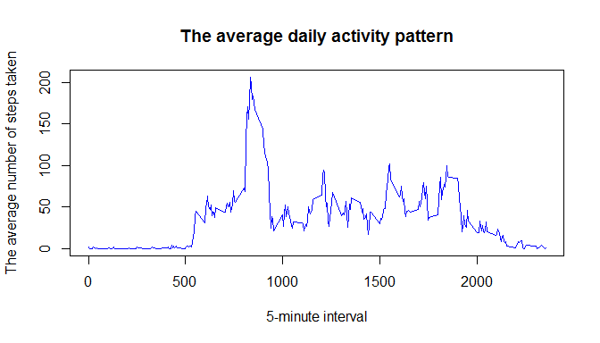
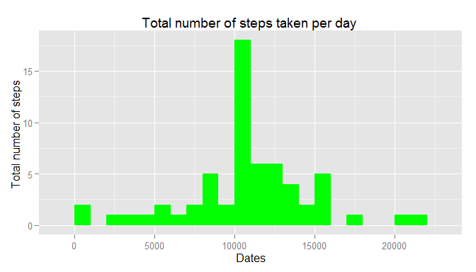
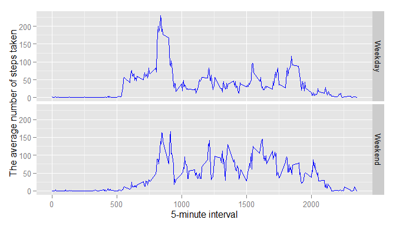

# Reproducible Research: Peer Assessment 1
###   
######R Markdown file created with R version 3.2.1 in R Studio with Knitr support
######Source code location: https://github.com/Desra/RepData_PeerAssessment1

##Introduction

This report is created to fulfill the requirements for the Coursera assignment "Reproducible Research: Peer Assessment 1" and is written in a single R Markdown document that is processed by knitr and later transformed into an HTML file. The dataset that is used for this assignment is stored in a comma-separated-value (CSV) file, found in the same github repository with the report . It consists of two months of data from a personal activity monitoring device that was collected between October 2012 and November 2012 and includes the number of steps taken in 5 minute intervals each day.

The report contains chunk of R codes, results and figure/charts in an attempt the answer the questions featured in the assignment with regards to the dataset.  


##Loading and preprocessing the data 

**1. Load the data**  
  
Step 1: Add ggplot2 library and disable the scientific notation displayed in plot (eg. 0.0004835312 instead of 4.835312e-04)  


```r
library(ggplot2)
options(scipen=999)
```
###
Step 2:set project working directory  


```r
directory <- c("C:")
setwd(directory)
```
###
Step 3: Download and unzip data file  


```r
fileName <- c("repdata_data_activity.zip")
if(!file.exists(fileName)) {
        setInternet2(use = TRUE)
        download.file("https://d396qusza40orc.cloudfront.net/repdata%2Fdata%2Factivity.zip", fileName)
        message("... Unzipping archived source data ...")
        unzip(fileName)
} else
        message("... Source file already exists ...")
```

```
## ... Unzipping archived source data ...
```
###
Step 4: Load data into a table  


```r
if(any(dir()=="activity.csv")) {   
        message("... Loading activity data ...")
        message("... This will take a while ;)  ...")
        activity_data <- read.csv("activity.csv", header = TRUE)
        message("... Loading data completed ...")
} else
        message("... File activity.csv doesn't exist ...")
```

```
## ... Loading activity data ...
## ... This will take a while ;)  ...
## ... Loading data completed ...
```

###  
**2. Process/transform the data into a format suitable for analysis**  


```r
activity_df <- data.frame(steps=activity_data[,1], 
                          datetaken=activity_data[,2], 
                          interval=activity_data[,3])
activity_df$datetaken <- as.Date(activity_df$datetaken, format="%Y-%m-%d")
activity_df2 <- na.omit(activity_df)
head(activity_df2)
```

```
##     steps  datetaken interval
## 289     0 2012-10-02        0
## 290     0 2012-10-02        5
## 291     0 2012-10-02       10
## 292     0 2012-10-02       15
## 293     0 2012-10-02       20
## 294     0 2012-10-02       25
```

###    
## What is mean total number of steps taken per day?  

###
**1. Calculate the total number of steps taken per day**  


```r
mean_df <- mean(activity_df2$steps)

aggregateSumStepsPerDay <- with(activity_df2, aggregate(activity_df2$steps, 
                                                        by=list(activity_df2$datetaken), 
                                                        sum))
```

###
**2. Make a histogram of the total number of steps taken each day**  


```r
names(aggregateSumStepsPerDay) <- c("dates","steps")
g <- ggplot(aggregateSumStepsPerDay, aes(x = steps))
g + geom_histogram(fill="magenta", binwidth=1000) +
        xlab("Dates") +
        ylab("Total number of steps ") +
        ggtitle("Total number of steps taken per day")
```

 


###
**3. Calculate and report the mean and median of the total number of steps taken per day**  


```r
meanStepsPerDay <- round(mean(aggregateSumStepsPerDay$steps), 2)
medianStepsPerDay <- round(median(aggregateSumStepsPerDay$steps), 2)
```
  

- Mean: **10766.19**
- Median: **10765**
  
###
###
## What is the average daily activity pattern?  

###
**1. Make a time series plot (i.e. type = "l") of the 5-minute interval (x-axis) and the average number of steps taken, averaged across all days (y-axis)**  

###
Step 1: Get average number of steps taken per interval  


```r
aggregateMeanStepsPerInterval <- with(activity_df2,aggregate(activity_df2$steps, 
                                                             by=list(activity_df2$interval), 
                                                             mean))
```
###  
Step 2: Plot the data using time series plot (base plot system)  


```r
names(aggregateMeanStepsPerInterval) <- c("interval","steps")
plot(aggregateMeanStepsPerInterval,
     type="l",  
     ylab="The average number of steps taken",
     xlab="5-minute interval",
     main="The average daily activity pattern",
     col="Blue")
```

 


###
**2. Which 5-minute interval, on average across all the days in the dataset, contains the maximum number of steps?**  


```r
maxSteps <- max(aggregateMeanStepsPerInterval$steps)
maxStepsIndex <- which.max(aggregateMeanStepsPerInterval$steps)
maxIntervalSteps <- aggregateMeanStepsPerInterval$interval[maxStepsIndex]
```

- Interval with maximum number of steps: **835** with maximum number of steps **206**  


## Imputing missing values  

###
**1. Calculate and report the total number of missing values in the dataset**  


```r
numMissingRecord <- nrow(activity_df) - nrow(activity_df2)
```
- Total number of records with missing values: **2304**  


###
**2. Devise a strategy for filling in all of the missing values in the dataset.**  

- Strategy: *Use the mean for that 5-minute interval to fill the missing value* 


```r
newStepsData <- numeric()
for (i in 1:nrow(activity_df)) 
{
        temp <- activity_df[i, ]
        if (is.na(temp$steps)) 
        {
                new_steps <- subset(aggregateMeanStepsPerInterval, interval == temp$interval)$steps
        } else 
        { 
                new_steps <- temp$steps
        }
        newStepsData <- c(newStepsData, new_steps)
}
```

###
**3. Create a new dataset that is equal to the original dataset but with the missing data filled in.**  


```r
activity_df_new <- data.frame(steps=newStepsData, 
                              datetaken=activity_df$datetaken, 
                              interval=activity_df$interval)
```


###
**4. Make a histogram of the total number of steps taken each day and Calculate and report the mean and median total number of steps taken per day.**  

###
Step 1: Get total average number of steps taken per day from the new dataset  


```r
aggregateSumStepsPerDay2<- with(activity_df_new,aggregate(steps, by=list(datetaken), sum))
```


###
Step 2: Plot the filled data using histogram  


```r
names(aggregateSumStepsPerDay2) <- c("dates","steps")
g <- ggplot(aggregateSumStepsPerDay2, aes(x = steps))
g + geom_histogram(fill="green", binwidth=1000) +
        xlab("Dates") +
        ylab("Total number of steps ") +
        ggtitle("Total number of steps taken per day ")
```

 


###
Step 3: Calculate and report the mean and median of the total number of steps taken per day  


```r
meanStepsPerDay2 <- round(mean(aggregateSumStepsPerDay2$steps),2)
medianStepsPerDay2 <-round(median(aggregateSumStepsPerDay2$steps), 2)
```
  
- Mean: **10766.19**  
- Median: **10766.19**  

###
**Do these values differ from the estimates from the first part of the assignment?**  
*No differences in terms of the mean value but the median value has changed from 10765 and is matching the value of mean, 10766.19*  

**What is the impact of imputing missing data on the estimates of the total daily number of steps?**  
*The change in the median has increased the height of the histogram, making the distribution a bit narrower, but this doesn't cause any impact in the estimates of the total daily number of steps*  


## Are there differences in activity patterns between weekdays and weekends?  

###
**1. Create a new factor variable in the dataset with two levels - "weekday" and "weekend" indicating whether a given date is a weekday or weekend day.**  

###
Step 1: Determine whether a given date is a weekday or weekend day  


```r
activity_df4 <- activity_df_new
activity_df4$datetaken <- as.Date(activity_df4$datetaken)

day <- weekdays(activity_df4$datetaken)
level <- vector()

for (i in 1:nrow(activity_df4)) {
        if (day[i] == "Saturday") 
        {
                level[i] <- "Weekend"
        } else if (day[i] == "Sunday") {
                level[i] <- "Weekend"
        } else {
                level[i] <- "Weekday"
        }
}
```

###
Step 2: Create a new factor variable in the dataset with two levels  


```r
activity_df4$level <- level
activity_df4$level <- factor(activity_df4$level)
aggregateSumStepsPerDay3<- with(activity_df4,aggregate(steps, by=list(interval,level), mean))
```


###
**2. Make a panel plot containing a time series plot (i.e. type = "l") of the 5-minute interval (x-axis) and the average number of steps taken, averaged across all weekday days or weekend days (y-axis).**  


```r
names(aggregateSumStepsPerDay3) <- c("interval", "daylevel", "steps")
ggplot(aggregateSumStepsPerDay3, aes(interval, steps)) + 
        geom_line(color="blue") + 
        facet_grid(daylevel ~.) +
        xlab("5-minute interval") + 
        ylab("The average number of steps taken")
```

 
